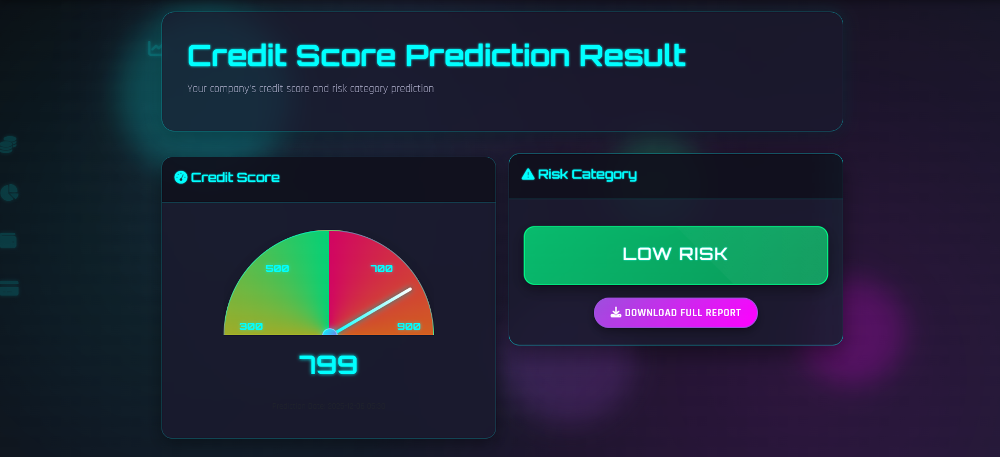
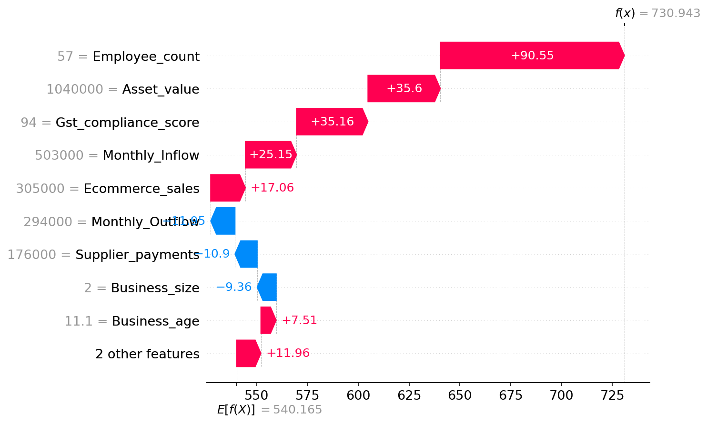
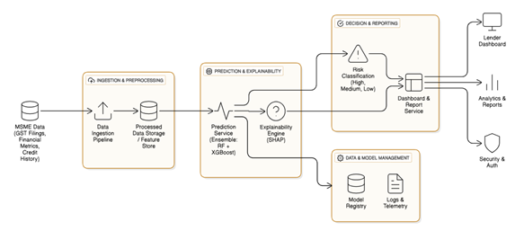

# XAI-Driven Credit Score Predictor

A comprehensive web-based application for predicting company credit scores using advanced machine learning models with explainable AI (SHAP) integration. This system provides transparent, interpretable credit risk assessments for financial institutions and businesses.


---

## 📋 Table of Contents

- [Abstract](#abstract)
- [Features](#features)
- [System Requirements](#system-requirements)
- [Technology Stack](#technology-stack)
- [Project Structure](#project-structure)
- [Installation Guide](#installation-guide)
- [Usage](#usage)
- [Machine Learning Model](#machine-learning-model)
- [Explainable AI (SHAP)](#explainable-ai-shap)
- [Architecture](#architecture)
- [License](#license)

---

## Abstract

This project implements an **Explainable AI (XAI)-driven credit score prediction system** that leverages machine learning algorithms to assess company creditworthiness. The system predicts credit scores ranging from 300 to 900 and categorizes companies into risk levels (High, Medium, or Low Risk). A key innovation of this system is the integration of SHAP (SHapley Additive exPlanations) values, providing transparent and interpretable explanations for each prediction, making it suitable for regulatory compliance and stakeholder trust.

**Key Workflow**: The system processes financial documents in PDF format (GST filings, financial statements, etc.) uploaded by users. Advanced text extraction algorithms automatically parse and extract financial metrics from these documents, which are then used to generate credit score predictions. PDFs are stored in the `src/uploads/` folder for processing.

### Key Capabilities

- ✅ **Real-time Credit Score Prediction**: Instant predictions based on 11 financial features
- ✅ **Risk Categorization**: Automatic classification into High/Medium/Low risk categories
- ✅ **Explainable AI**: SHAP-based feature importance visualization
- ✅ **Interactive Visualizations**: Waterfall and force plots for model interpretability
- ✅ **Prediction History**: Comprehensive tracking of all predictions
- ✅ **Analytics Dashboard**: Trend analysis and statistical insights
- ✅ **PDF Report Generation**: Exportable prediction reports
- ✅ **Admin Panel**: System-wide monitoring and management

---

## Features

### For End Users (Companies)

- **User Registration & Authentication**: Secure login system with password hashing
- **Credit Score Prediction**: Input financial data through an intuitive web interface
- **Risk Assessment**: Automatic categorization with visual indicators
- **Explainable Predictions**: Interactive SHAP visualizations showing feature contributions
- **Prediction History**: Complete audit trail of all predictions
- **Analytics Dashboard**: Visual trend analysis with Chart.js
- **Downloadable Reports**: PDF export functionality for documentation

### For Administrators

- **Admin Dashboard**: System-wide statistics and analytics
- **Company Management**: View and manage all registered companies
- **Prediction Monitoring**: Access to all company predictions
- **System Analytics**: Aggregate insights across all users
- **Risk Distribution Analysis**: Visual breakdown of risk categories

---

## System Requirements

### Minimum Requirements

- **Operating System**: Windows 10/11, macOS 10.15+, or Linux (Ubuntu 20.04+)
- **Python**: Version 3.11 or higher
- **RAM**: 4 GB minimum (8 GB recommended)
- **Storage**: 500 MB free space
- **Internet Connection**: Required for initial package installation

### Software Dependencies

All required Python packages are listed in `requirements.txt` with specific versions. See [Installation Guide](#installation-guide) for detailed setup instructions.

---

## Technology Stack

### Backend Framework

| Technology | Version | Purpose |
|------------|---------|---------|
| **Flask** | 3.1.0 | Python web framework for building RESTful APIs and web applications |
| **Flask-Login** | 0.6.3 | User session management and authentication |
| **Flask-SQLAlchemy** | 3.1.1 | ORM for database operations |
| **Werkzeug** | 3.1.3 | Password hashing and security utilities |
| **SQLAlchemy** | 2.0.44 | Database abstraction layer |

### Machine Learning & Data Science

| Technology | Version | Purpose |
|------------|---------|---------|
| **scikit-learn** | 1.6.1 | Machine learning library for model training and inference |
| **pandas** | 2.2.3 | Data manipulation and analysis |
| **numpy** | 2.1.3 | Numerical computing and array operations |
| **joblib** | 1.4.2 | Model serialization and loading |
| **SHAP** | 0.50.0 | Model explainability and interpretability framework |
| **matplotlib** | 3.9.2 | Plotting and visualization for SHAP plots |

### PDF Processing

| Technology | Version | Purpose |
|------------|---------|---------|
| **pdfplumber** | 0.11.8 | PDF text extraction and processing |
| **PyMuPDF** | 1.26.6 | Advanced PDF manipulation |

### Frontend Technologies

- **HTML5**: Structure and markup
- **CSS3**: Modern neon-themed responsive design
- **JavaScript (ES6+)**: Interactive functionality and animations
- **Bootstrap 5**: Responsive UI framework (via CDN)
- **Chart.js**: Data visualization for analytics dashboard
- **jsPDF**: Client-side PDF generation
- **Font Awesome**: Icon library (via CDN)

### Database

- **SQLite 3**: Lightweight relational database (stored in `src/instance/credit_predictor.db`)

### Template Engine

- **Jinja2** 3.1.4: Server-side template rendering (bundled with Flask)

---

## Project Structure

```
XAI-Driven-Credit-Score-Predictor/
│
├── README.md                      # Project documentation (this file)
├── requirements.txt               # Python dependencies with versions
├── LICENSE                        # License file
│
├── dataset/                       # Training datasets
│   └── cibil_data3.csv           # Training data for model development
│
├── results/                       # Model training results and outputs
│
├── src/                           # Main application source code
│   │
│   ├── app.py                     # Main Flask application file
│   ├── config.py                  # Application configuration settings
│   ├── run.py                     # Application entry point
│   │
│   ├── models/                    # Database models (SQLAlchemy ORM)
│   │   ├── __init__.py           # Database initialization
│   │   ├── user.py               # User/Company model
│   │   ├── prediction.py         # Prediction model
│   │   └── company_profile.py    # Company profile model
│   │
│   ├── ml_models/                 # Trained machine learning models
│   │   ├── best_cibil_model1.pkl # Trained credit score prediction model
│   │   └── encoder1.pkl         # Label encoder for categorical features
│   │
│   ├── templates/                 # HTML templates (Jinja2)
│   │   ├── base.html             # Base template with navigation
│   │   ├── index.html            # Landing page / dashboard
│   │   ├── login.html            # User login page
│   │   ├── register.html         # User registration page
│   │   ├── predict.html          # Credit score prediction form
│   │   ├── prediction_result.html # Prediction results with SHAP visualizations
│   │   ├── history.html          # Prediction history page
│   │   ├── analytics.html        # Analytics dashboard
│   │   ├── admin_login.html      # Admin login page
│   │   ├── admin_dashboard.html  # Admin main dashboard
│   │   ├── admin_companies.html  # Admin company list
│   │   └── admin_company_predictions.html # Admin view of company predictions
│   │
│   ├── static/                    # Static assets
│   │   ├── css/
│   │   │   ├── style.css         # Main stylesheet with neon theme
│   │   │   └── speedometer.css   # Speedometer animation styles
│   │   ├── js/
│   │   │   ├── main.js           # Main JavaScript functionality
│   │   │   └── speedometer.js    # Speedometer visualization script
│   │   ├── images/               # Images and logos
│   │   │   ├── bg.jpg            # Background image
│   │   │   ├── logo.png          # Application logo
│   │   │   └── lendwise-logo.svg # SVG logo
│   │   └── shap/                 # Generated SHAP visualizations
│   │       ├── pred_*.html       # Interactive SHAP force plots
│   │       └── pred_*.png        # SHAP waterfall plots
│   │
│   ├── instance/                  # Application instance folder
│   │   └── credit_predictor.db   # SQLite database file (created on first run)
│   │
│   ├── uploads/                    # User-uploaded PDF files
│   │
│   └── utils/                      # Utility modules
│       ├── __init__.py
│       ├── pdf_extractor.py       # PDF text extraction utility
│       └── diff_checker.py        # Profile comparison utility
│
└── __pycache__/                   # Python bytecode cache (auto-generated)
```

---

## Installation Guide

### Prerequisites

Before installing the application, ensure you have the following:

1. **Python 3.11 or higher** installed on your system
   - Download from [python.org](https://www.python.org/downloads/)
   - Verify installation: `python --version` or `python3 --version`
   
2. **pip** (Python package manager)
   - Usually comes with Python installation
   - Verify: `pip --version` or `pip3 --version`

3. **Git** (optional, for cloning the repository)
   - Download from [git-scm.com](https://git-scm.com/downloads)

### Step-by-Step Installation

#### Step 1: Clone or Download the Repository

If using Git:
```bash
git clone <repository-url>
cd XAI-Driven-Credit-Score-Predictor
```

Or download and extract the ZIP file to your desired location.

#### Step 2: Navigate to Project Directory

```bash
cd XAI-Driven-Credit-Score-Predictor
```

#### Step 3: Create Virtual Environment

**Windows (PowerShell):**
```powershell
python -m venv venv
```

**Windows (Command Prompt):**
```cmd
python -m venv venv
```

**macOS/Linux:**
```bash
python3 -m venv venv
```

**Alternative: Using VS Code**
- Open the project folder in VS Code
- Press `Ctrl+Shift+P` (or `Cmd+Shift+P` on Mac)
- Type: `Python: Select Interpreter`
- Choose: `Create Virtual Environment`
- Select Python version 3.11+

#### Step 4: Activate Virtual Environment

**Windows (PowerShell):**
```powershell
.\venv\Scripts\Activate.ps1
```

**Windows (Command Prompt):**
```cmd
venv\Scripts\activate.bat
```

**macOS/Linux:**
```bash
source venv/bin/activate
```

You should see `(venv)` in your terminal prompt, indicating the virtual environment is active.

#### Step 5: Upgrade pip (Recommended)

```bash
python -m pip install --upgrade pip
```

#### Step 6: Install Dependencies

Install all required packages with specific versions:

```bash
pip install -r requirements.txt
```

This will install:
- Flask 3.1.0
- Flask-Login 0.6.3
- Flask-SQLAlchemy 3.1.1
- scikit-learn 1.6.1
- pandas 2.2.3
- numpy 2.1.3
- joblib 1.4.2
- shap 0.50.0
- matplotlib 3.9.2
- pdfplumber 0.11.8
- PyMuPDF 1.26.6
- And all their dependencies

**Verification:**
```bash
pip list
```

#### Step 7: Verify Model Files

Ensure the following model files exist in `src/ml_models/`:
- `best_cibil_model1.pkl` - Trained credit score prediction model
- `encoder1.pkl` - Label encoder for categorical features

If these files are missing, the application will log an error but continue to run (predictions will be unavailable).

#### Step 8: Run the Application

Navigate to the `src` directory:

```bash
cd src
```

Start the Flask development server:

```bash
python run.py
```

Or alternatively:

```bash
python app.py
```

You should see output similar to:
```
 * Running on http://127.0.0.1:5000
 * Debug mode: on
```

#### Step 9: Access the Application

Open your web browser and navigate to:
- **Local URL**: `http://127.0.0.1:5000` or `http://localhost:5000`

### First-Time Setup Notes

1. **Database Initialization**: The SQLite database (`instance/credit_predictor.db`) will be created automatically on first run.

2. **Default Admin Credentials**:
   - Username: `admin`
   - Password: `admin123`
   - **⚠️ IMPORTANT**: Change these credentials in `src/config.py` before deploying to production!

3. **Directory Creation**: The following directories are created automatically if they don't exist:
   - `src/instance/` - Database storage
   - `src/static/shap/` - SHAP visualization storage
   - `src/uploads/` - PDF upload storage

### Installation Verification

To verify the installation is successful:

1. Check that the server starts without errors
2. Access the homepage at `http://localhost:5000`
3. Try registering a new user account
4. Upload a test PDF document with financial data
5. Verify that data extraction and prediction work correctly

### PDF Document Requirements

For predictions to work correctly, ensure PDF documents contain the following information:

- **Financial Statements**: Monthly inflow/outflow, asset values
- **GST Filings**: GST compliance scores
- **Business Information**: Company name, business age, business size, employee count
- **Transaction Records**: Invoice details, supplier payments, e-commerce sales

The system will attempt to extract all 11 required features from the PDF. If some fields cannot be extracted, you may need to manually verify or correct them in the auto-filled form.

---

## Usage

### For Regular Users

#### 1. Registration

1. Navigate to the homepage
2. Click **"Register"** in the navigation bar
3. Fill in company details:
   - Company Name
   - Email Address
   - Company Type
   - Country
   - Password
4. Click **"Register"** to create your account

#### 2. Login

1. Click **"Login"** in the navigation bar
2. Enter your email and password
3. Click **"Login"** to access your dashboard

#### 3. Make a Credit Score Prediction

**Important**: The system uses **PDF document upload** for predictions. Manual form entry is not the primary method.

1. Click **"Predict Credit Score"** from the dashboard
2. **Upload PDF Document**:
   - Click **"Upload and Extract"** button
   - Select a PDF file containing company financial data (GST filings, financial statements, etc.)
   - The PDF should contain the following financial metrics:
     - Monthly Inflow
     - Monthly Outflow
     - GST Compliance Score
     - E-commerce Sales
     - Supplier Payments
     - Invoice Issued (count)
     - Invoice Amount
     - Employee Count
     - Asset Value
     - Business Age (years)
     - Business Size (Small/Medium/Large)
   - The system will automatically extract data from the PDF using advanced text extraction algorithms
3. **Review Extracted Data**: 
   - The form fields will be auto-filled with extracted values
   - Verify and correct any extraction errors if needed
4. **Run Prediction**: Click **"Predict"** to generate credit score
5. **View Results**:
   - Credit score displayed on animated speedometer
   - Risk category badge (High/Medium/Low)
   - SHAP visualizations (waterfall and force plots) showing feature contributions
   - Feature importance explanations
   - Downloadable PDF report

**Note**: PDFs are stored in the `src/uploads/` folder after upload. The system processes PDFs from this directory for predictions.

#### 4. View Prediction History

1. Navigate to **"Prediction History"**
2. View all past predictions in a table
3. Click on any prediction to view detailed results

#### 5. View Analytics

1. Navigate to **"Analytics"**
2. View:
   - Score trends over time (line chart)
   - Highest, lowest, average, and latest scores
   - Visual trend analysis

### For Administrators

#### 1. Admin Login

1. Navigate to `/admin/login`
2. Enter admin credentials
3. Access admin dashboard

#### 2. Admin Dashboard

- View system-wide statistics
- Monitor total companies and predictions
- See risk category distributions
- Access company and prediction management

#### 3. Company Management

- View all registered companies
- Access individual company prediction histories
- Monitor company activity

---

## Machine Learning Model

### Model Architecture

The application uses an **ensemble machine learning model** combining **Random Forest (RF)** and **XGBoost** algorithms trained on company financial data extracted from PDF documents. The ensemble approach improves prediction accuracy and robustness. The models are serialized using `joblib` and loaded at application startup.

### Model Files

- **`src/ml_models/best_cibil_model1.pkl`**: The trained ensemble credit score prediction model
- **`src/ml_models/encoder1.pkl`**: Label encoder for the categorical feature `Business_size`

### Input Features (11 Features)

The model accepts the following financial inputs, which are **automatically extracted from uploaded PDF documents**:

| Feature | Type | Description | Range/Values | Source in PDF |
|---------|------|-------------|--------------|---------------|
| **Monthly_Inflow** | Float | Monthly cash inflow in currency units | ≥ 0 | Financial statements, bank statements |
| **Monthly_Outflow** | Float | Monthly cash outflow in currency units | ≥ 0 | Financial statements, bank statements |
| **Gst_compliance_score** | Float | GST compliance rating | 0-100 | GST filings, compliance reports |
| **Ecommerce_sales** | Float | E-commerce sales revenue | ≥ 0 | Sales reports, income statements |
| **Supplier_payments** | Float | Payments made to suppliers | ≥ 0 | Accounts payable, payment records |
| **Invoice_issued** | Integer | Number of invoices issued | ≥ 0 | Invoice records, billing statements |
| **Invoice_amount** | Float | Total invoice amount | ≥ 0 | Invoice records, revenue reports |
| **Employee_count** | Integer | Number of employees | ≥ 0 | HR records, payroll documents |
| **Asset_value** | Float | Total asset value | ≥ 0 | Balance sheets, asset registers |
| **Business_age** | Float | Age of the business in years | ≥ 0 | Company registration, incorporation date |
| **Business_size** | Categorical | Business size category | Small/Medium/Large | Company profile, registration documents |

**Data Extraction Process**: The system uses `pdfplumber` and `PyMuPDF` libraries to extract text from PDF documents, then applies pattern matching and natural language processing to identify and extract these financial metrics automatically.

### Output

- **Credit Score**: Integer value ranging from **300 to 900**
- **Risk Category**: 
  - **High Risk**: Score ≤ 600
  - **Medium Risk**: 601 ≤ Score ≤ 750
  - **Low Risk**: Score > 750



*Figure 2: Example credit score prediction result dashboard showing the speedometer visualization (score: 799), risk category classification (Low Risk), and downloadable report option.*

### Model Loading

The ensemble model (Random Forest + XGBoost) and encoder are loaded once at application startup from the `src/ml_models/` directory. If loading fails, the application logs an error but continues to run (predictions will be unavailable).

### PDF Processing Workflow

1. **PDF Upload**: Users upload financial documents in PDF format via the web interface
2. **Text Extraction**: The system uses `pdfplumber` (primary) and `PyMuPDF` (fallback) to extract text content
3. **Data Parsing**: Advanced regex patterns and NLP techniques identify financial metrics from unstructured text
4. **Data Normalization**: Extracted values are cleaned (remove currency symbols, commas) and converted to appropriate data types
5. **Feature Extraction**: The 11 required features are extracted and validated
6. **Auto-fill Form**: Extracted data automatically populates the prediction form for user verification
7. **Prediction**: Once verified, the data is fed to the ensemble model for credit score prediction

**Important Note**: PDFs are stored in the `src/uploads/` folder after upload. The system processes PDFs from this directory for predictions. Manual form entry is available for verification/correction but the primary workflow relies on PDF document processing.

---

## Explainable AI (SHAP)

### What is SHAP?

SHAP (SHapley Additive exPlanations) is a unified framework for explaining the output of machine learning models. It provides a mathematically rigorous way to quantify the contribution of each feature to a specific prediction, based on cooperative game theory.

### SHAP Integration in This Project

The application uses **SHAP TreeExplainer** (optimized for tree-based models) to generate explanations for each prediction:

#### 1. Background Dataset

- Automatically searches for training datasets in the project root (`dataset/` directory)
- Uses a sample (200 instances) as background for SHAP calculations
- Falls back to model-only explainer if no dataset is found

#### 2. Generated Visualizations

- **Waterfall Plot (PNG)**: Shows how each feature contributes to the final prediction score, displaying the cumulative effect of features
- **Force Plot (Interactive HTML)**: Interactive visualization showing feature impacts with color coding (red for negative, blue for positive contributions)

### Example SHAP Visualization



*Example SHAP waterfall plot showing feature contributions to a credit score prediction*

---

## Architecture

### System Architecture Diagram



*Figure 1: High-level system architecture showing the complete data flow from MSME data ingestion through prediction, explainability, and reporting.*

The architecture consists of four main functional blocks:

1. **INGESTION & PREPROCESSING**: Handles PDF document uploads, data extraction, and feature preparation
2. **PREDICTION & EXPLAINABILITY**: Ensemble ML models (Random Forest + XGBoost) generate predictions with SHAP-based explanations
3. **DECISION & REPORTING**: Risk classification and dashboard/report generation
4. **DATA & MODEL MANAGEMENT**: Model registry and system monitoring

### Data Flow

1. **PDF Upload**: User uploads financial documents (PDF format) containing company financial data
2. **Data Extraction**: PDF text extraction using `pdfplumber` and `PyMuPDF` to parse financial metrics
3. **Data Preprocessing**: Extracted data is normalized, validated, and converted to pandas DataFrame format
4. **Feature Encoding**: Categorical features (e.g., Business_size) are encoded using the trained label encoder
5. **Model Inference**: Ensemble model (Random Forest + XGBoost) generates credit score prediction (300-900 range)
6. **Risk Classification**: Score is automatically categorized into High/Medium/Low risk levels
7. **SHAP Explanation**: SHAP TreeExplainer calculates feature contributions for model interpretability
8. **Database Storage**: Prediction results, input features, and metadata are saved to SQLite database
9. **Visualization Generation**: SHAP waterfall and force plots are generated and stored
10. **Response Rendering**: Results displayed to user with interactive visualizations and downloadable reports

### Technology Stack Layers

- **Presentation Layer**: HTML/CSS/JavaScript (Bootstrap, Chart.js)
- **Application Layer**: Flask (Python)
- **Business Logic Layer**: Custom Python modules
- **Data Access Layer**: SQLAlchemy ORM
- **Data Storage Layer**: SQLite database
- **ML Layer**: scikit-learn, SHAP

---


## License

This project is proprietary software. All rights reserved.

**Copyright © 2024**

